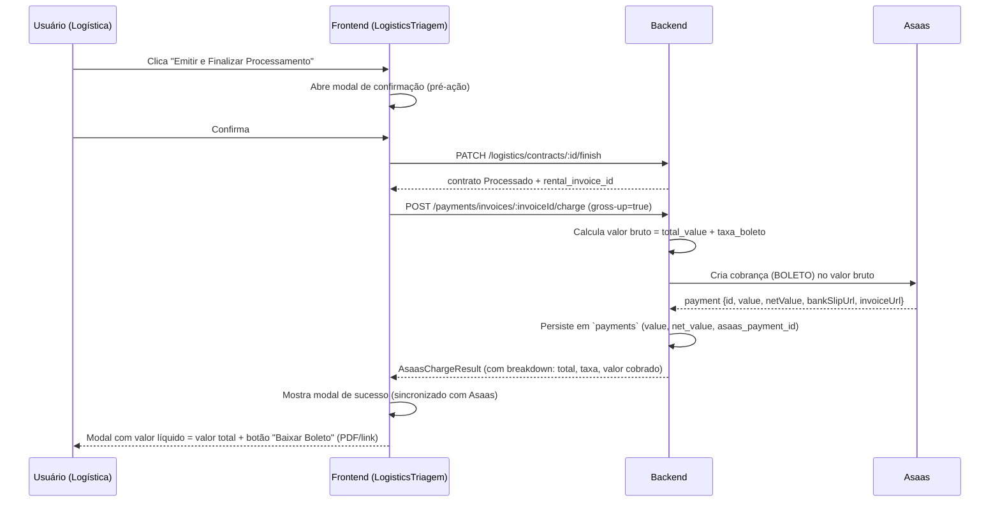

# Plano — Emissão de Boleto na Triagem + Notas Fiscais de Locação

> Gerado a partir de uma análise do repositório frontend (`RentDesk`) em 31/07/2026, cruzando `LogisticsTriagem.tsx`, `RentalEdit.tsx`, `services/financeiro.ts`, `types/index.ts` e `config_files/database-schema-documentation.md`.
> Este documento cobre: (1) o plano de frontend deste repositório, (2) a especificação/contrato para o plano de backend (repositório separado, não presente neste workspace), e (3) um prompt pronto para levar a um agente/sessão de planejamento no repositório do backend.

---

## 1. Contexto — o que já existe vs. o que falta

### 1.1 Já implementado e funcionando hoje

| Item | Onde |
|---|---|
| Subconta da locadora no Asaas (setup) | `Financeiro > Subconta` (`SubaccountTab.tsx`) |
| Sincronização de cliente com Asaas (`asaas_customer_id`) | `ClientForm.tsx` |
| Geração de cobrança/boleto (`POST /payments/invoices/:id/charge`) | `RentalEdit.tsx`, `Rentals.tsx` (botão "Gerar Cobrança" → modal de confirmação → "Ver Boleto") |
| Emissão de NFS-e via Asaas (`POST /fiscal/invoices/:id/nfse`) | `RentalEdit.tsx` (badge de status, link da nota, XML, "Atualizar Status") |
| Tabela `payments` com `value` (bruto) e `net_value` (líquido, pós-taxa Asaas) | Backend / Supabase |
| Campo `iss_regime: 'Isento' \| 'Tributado'` já modelado em `invoice_nfse` | Backend / Supabase + `types/index.ts` |

### 1.2 O gap real desta tarefa

A tela **Iniciar Triagem** (`LogisticsTriagem.tsx`, Etapa 3 "Emissão") **não integra com o Asaas hoje**. O botão **"Emitir e Finalizar Processamento"** apenas chama `PATCH /logistics/contracts/:id/finish`, que cria o `rental_invoice` e muda o contrato para `Processado`. Não há geração de boleto, não há modal de confirmação, não há link de download.

É isso que a tarefa pede para fechar — reaproveitando o padrão de UI que já existe em `RentalEdit.tsx`, mas com uma regra financeira nova: **o valor líquido recebido deve ser igual ao valor total do contrato** (hoje o Asaas desconta uma taxa fixa por boleto do `net_value`, então sem ajuste o locador recebe menos que o total faturado).

---

## 2. Decisões de negócio confirmadas nesta sessão

1. **Mecânica do "aumentar o desconto" → repasse da taxa (gross-up).** O valor cobrado no boleto deve ser aumentado pelo valor da taxa do Asaas, de forma que, depois da taxa ser descontada, o `net_value` recebido pela locadora seja igual ao `total_value` da fatura. O cliente paga um pouco a mais que o valor "cheio" da locação (a taxa do boleto é repassada), mas a locadora nunca recebe menos que o contratado.
2. **Escopo desta etapa = apenas boleto.** A emissão de NFS-e **não** entra no fluxo de "Emitir e Finalizar Processamento" da triagem. NFS-e continua um passo manual, feito depois, na tela "Editar Locação" (como já é hoje).
3. **Legislação (Súmula Vinculante 31/STF sobre ISS em locação de bens móveis).** Já está contemplada no modelo de dados (`iss_regime = 'Isento'`). Não há mudança de estratégia fiscal nesta tarefa — é só manter o padrão já adotado. (Ver §5 para uma nota de atenção operacional, não de código.)
4. **Backend é repositório separado.** Este documento contém a especificação/contrato do que o backend precisa fazer, para ser usado como insumo de um plano *dentro* do repositório do backend (ver §6, prompt pronto).

---

## 3. Fluxo alvo (end-to-end)



Pontos de falha tratados no fluxo (ver §4.5 e §5.5):
- Triagem finaliza mas cobrança falha → contrato fica `Processado` sem boleto, com opção de tentar novamente depois (sem travar a operação).
- Já existe cobrança para a fatura (ex.: reprocessamento) → segunda via, sem duplicar.

---

## 4. Plano de Frontend (este repositório)

### 4.1 Arquivos afetados

- `src/pages/LogisticsTriagem.tsx` — principal alvo das mudanças.
- `src/types/index.ts` — estender `AsaasChargeResult` com o breakdown de gross-up.
- `src/services/financeiro.ts` — nenhuma mudança de assinatura (mesmo endpoint `gerarCobranca`), só acompanhar o novo shape de resposta.
- Possível novo componente compartilhado: `src/components/logistics/ChargeResultModal.tsx` (ou inline no próprio arquivo, seguindo o padrão atual do projeto de manter modais inline nas páginas grandes).

### 4.2 Tipos (`types/index.ts`)

Estender `AsaasChargeResult` para carregar o breakdown do gross-up (o backend precisa devolver isso para a modal mostrar "valor cobrado no boleto" vs. "valor líquido/total do contrato"):

```typescript
export interface AsaasChargeResult {
  invoice_id: string;
  charge: {
    id: string;
    status: string;
    value: number;           // valor bruto cobrado no boleto (com gross-up)
    invoiceUrl: string;
    bankSlipUrl?: string;
    [key: string]: unknown;
  };
  payment: Record<string, unknown>;
  breakdown?: {
    total_value: number;      // valor total da fatura/contrato (o que a locadora precisa receber)
    fee_amount: number;       // taxa do Asaas repassada
    charged_value: number;    // total_value + fee_amount (== charge.value)
    net_value: number;        // valor líquido projetado (deve ser == total_value)
  };
}
```

### 4.3 Mudanças de comportamento em `LogisticsTriagem.tsx`

**Estado novo:**
```typescript
const [chargeConfirmOpen, setChargeConfirmOpen] = useState(false);
const [chargeResult, setChargeResult] = useState<AsaasChargeResult | null>(null);
const [chargeResultModalOpen, setChargeResultModalOpen] = useState(false);
const [chargeError, setChargeError] = useState<string | null>(null);
```

**`handleFinish` reescrito** (fluxo sequencial, com estados de loading distintos para cada etapa):

1. Usuário clica "Emitir e Finalizar Processamento" → abre modal de confirmação **pré-ação** (reaproveitar o mesmo componente visual de `RentalEdit.tsx`/`Rentals.tsx`: aviso de que vai gerar boleto e finalizar).
2. Ao confirmar:
   a. `await logisticsService.finishProcessing(contract.id, {...})` — igual hoje.
   b. Com o `rental_invoice_id` retornado (ou já existente em `contract.rental_invoice_id`), chamar `await financeiroService.gerarCobranca(rentalInvoiceId)`.
   c. Guardar o resultado em `chargeResult`.
   d. Fechar o modal de confirmação, abrir o **modal de resultado** (`chargeResultModalOpen = true`).
3. Modal de resultado mostra:
   - Selo "Sincronizado com Asaas" (ícone de sucesso).
   - Valor total do contrato vs. valor líquido projetado (devem bater — se não baterem, mostrar aviso visual, ver §4.5).
   - Botão **"Baixar Boleto"**, estilizado igual ao botão existente "Download PDF do Checklist" (mesmo padrão visual: `bg-mustard-500`, ícone `download`), apontando para `chargeResult.charge.bankSlipUrl` (preferencial, é o PDF do boleto) com fallback para `invoiceUrl`.
   - Botão secundário "Ver Fatura no Asaas" (`invoiceUrl`), no mesmo padrão do botão "Visualizar PDF do Checklist" (outline).
   - Botão "Ir para Logística" para fechar e navegar, com o mesmo `setTimeout` de redirecionamento que já existe hoje (ou manual, deixando o usuário revisar o boleto antes de sair — recomendo remover o auto-redirect de 2s atual, já que agora há uma ação (baixar boleto) que o usuário pode querer fazer antes de sair).

**Reaproveitamento de UI**: o modal de confirmação pré-ação já existe, pixel a pixel, em `RentalEdit.tsx` (linhas 682–726) e `Rentals.tsx`. Extrair esse padrão (ou copiar o JSX) para manter consistência visual — mesma paleta, mesmo texto de aviso adaptando para "vai finalizar a triagem e gerar boleto".

### 4.4 Botão de download do boleto — reaproveitando o padrão existente

O botão de referência já está em `LogisticsTriagem.tsx` (linhas 790–813, "Download PDF do Checklist"). O novo botão de boleto deve seguir exatamente esse estilo, mas com `<a href={bankSlipUrl} target="_blank">` em vez de gerar um blob local (o PDF do boleto é servido pelo próprio Asaas, não precisa de `@react-pdf/renderer`):

```tsx
<a
  href={chargeResult.charge.bankSlipUrl || chargeResult.charge.invoiceUrl}
  target="_blank"
  rel="noopener noreferrer"
  className="px-5 py-3 bg-mustard-500 text-white rounded-xl text-sm font-bold hover:bg-mustard-600 transition-colors flex items-center gap-2 shadow-md shadow-mustard-500/10"
>
  <span className="material-symbols-outlined text-[18px]">download</span>
  Baixar Boleto
</a>
```

### 4.5 Tratamento de erros / estados de borda

- **Triagem finaliza, cobrança falha** (ex.: cliente sem `asaas_customer_id`, subconta não configurada): não reverter o `finish` (o contrato já virou `Processado` e o `rental_invoice` já existe — reverter geraria inconsistência). Mostrar erro claro no modal ("Contrato processado, mas houve um erro ao gerar o boleto") + botão "Tentar Gerar Boleto Novamente" que chama só `gerarCobranca` de novo (idempotente no backend, ver §5.4).
- **`net_value` devolvido não bate com `total_value`** (arredondamento, mudança de taxa entre cálculo e criação real no Asaas): mostrar a diferença de forma transparente na modal (não esconder), já que é uma situação que a locadora precisa saber para conciliação bancária depois.
- **Cobrança já existe para a fatura** (reprocessamento / segunda via): backend deve devolver a cobrança existente em vez de duplicar (mesmo comportamento que `RentalEdit.tsx` já assume ao checar `hasCharge`).

### 4.6 Checklist de aceite (frontend)

- [ ] Clicar "Emitir e Finalizar Processamento" abre modal de confirmação antes de qualquer chamada de API.
- [ ] Após confirmar, a triagem é finalizada E o boleto é gerado em sequência, com um único indicador de loading cobrindo as duas chamadas.
- [ ] Modal de sucesso mostra valor líquido projetado igual ao valor total do contrato.
- [ ] Botão "Baixar Boleto" funciona e abre o PDF do boleto (via Asaas).
- [ ] Falha na geração do boleto não impede a triagem de ter sido finalizada, e oferece retry.
- [ ] Nenhuma emissão de NFS-e é disparada nesse fluxo.

---

## 5. Plano de Backend (especificação / contrato — repositório separado)

> O backend não está neste workspace. Esta seção descreve **o que precisa ser verdade na API** para o frontend acima funcionar — é o contrato a ser usado ao planejar dentro do repositório do backend.

### 5.1 Mudança de schema

**`erp_company_settings`** — adicionar configuração da taxa de boleto (o valor da taxa Asaas por boleto varia por plano/negociação da subconta, não é uma constante universal):

| Coluna nova | Tipo | Notas |
|---|---|---|
| `asaas_boleto_fee` | `numeric` | Taxa fixa cobrada pelo Asaas por boleto emitido (ex.: `1.99`). Configurável por locadora. |
| `asaas_pix_fee` | `numeric` (opcional) | Mesma lógica para PIX, caso o gross-up deva valer para outros meios de pagamento no futuro. |

Alternativa mais robusta (fase 2): buscar a taxa dinamicamente via API do Asaas (endpoint de conta/planos) em vez de manter hardcoded — mas isso adiciona uma chamada externa a cada cobrança; recomendo começar com a coluna configurável (MVP) e migrar depois se a taxa mudar com frequência.

**`payments`** — nenhuma mudança estrutural necessária; `value` e `net_value` já existem e recebem exatamente os números pós-gross-up.

### 5.2 Alteração no controller de cobrança

Endpoint existente: `POST /api/payments/invoices/:invoiceId/charge`.

Lógica nova a inserir:

1. Buscar `rental_invoices.total_value` da fatura.
2. Buscar `erp_company_settings.asaas_boleto_fee` da locadora (ou valor default de fallback, com log de aviso se não configurado).
3. Calcular `charged_value = total_value + asaas_boleto_fee`.
4. Criar a cobrança no Asaas com `value = charged_value` (em vez de `value = total_value`, como deve estar hoje).
5. Persistir em `payments`: `value = charged_value`, `net_value = total_value` (valor líquido esperado/alvo) **e** guardar também o `netValue` que o Asaas eventualmente retornar/confirmar via webhook, para fins de conciliação (ver §5.5 sobre divergência).
6. Retornar no payload de resposta o breakdown (`total_value`, `fee_amount`, `charged_value`, `net_value`) conforme contrato de tipos do §4.2.

**Importante:** essa mudança afeta **todo** lugar que chama esse endpoint (inclusive o botão "Gerar Cobrança" já existente em `RentalEdit.tsx`/`Rentals.tsx`), não só o fluxo novo da triagem — isso é intencional, já que a regra "valor líquido = valor total" foi confirmada como regra geral de negócio, não específica da triagem.

### 5.3 Contrato de API atualizado

**Request** (sem mudança): `POST /payments/invoices/:invoiceId/charge` — sem body obrigatório novo. Opcional: `{ "billing_type"?: "BOLETO" | "PIX" }` se o gross-up precisar variar por meio de pagamento.

**Response** (novo shape, retrocompatível — `breakdown` é aditivo):

```json
{
  "invoice_id": "uuid",
  "charge": {
    "id": "pay_xxx",
    "status": "PENDING",
    "value": 10201.99,
    "invoiceUrl": "https://sandbox.asaas.com/i/xxx",
    "bankSlipUrl": "https://sandbox.asaas.com/b/pdf/xxx"
  },
  "payment": { "...": "registro salvo em `payments`" },
  "breakdown": {
    "total_value": 10200.00,
    "fee_amount": 1.99,
    "charged_value": 10201.99,
    "net_value": 10200.00
  }
}
```

### 5.4 Idempotência / segunda via

- Antes de criar uma nova cobrança, verificar se já existe um `payment` ativo (`status` não `CANCELLED`) para o `invoice_id`. Se existir, devolver a cobrança existente (mesmo shape de resposta) em vez de criar duplicata — o frontend de `RentalEdit.tsx` já assume esse comportamento (`hasCharge`), então o endpoint de triagem deve manter a mesma regra.
- Isso também resolve o caso de "retry" após falha parcial descrito em §4.5: se a triagem já finalizou mas o boleto falhou, o retry simplesmente chama o mesmo endpoint de novo, que vai criar (não vai haver duplicata porque ainda não existe cobrança bem-sucedida).

### 5.5 Webhook e conciliação (divergência de valor líquido real)

O `net_value` calculado no momento da criação da cobrança é uma **projeção**. O valor líquido real definitivo só é confirmado quando o Asaas processa o pagamento e dispara o webhook (`asaas_webhook_logs`, evento `PAYMENT_RECEIVED`/`PAYMENT_CONFIRMED`), que deve trazer o `netValue` real.

Recomendação: no processamento do webhook, se o `netValue` real vier diferente do `net_value` gravado na criação (ex.: taxa do Asaas mudou entre a criação e o pagamento), atualizar `payments.net_value` com o valor real e opcionalmente logar/alertar (não é um erro crítico, mas é relevante para conciliação financeira e para saber se a taxa configurada em `erp_company_settings.asaas_boleto_fee` está desatualizada).

### 5.6 Nota fiscal / legislação — sem mudança nesta tarefa

Confirmado em §2.3: manter `iss_regime = 'Isento'` como já modelado. Nenhuma alteração de schema ou de regra fiscal é necessária para esta tarefa específica. Fica como nota de atenção operacional (não técnica): vale revisar periodicamente com o contador se o município da locadora exige algum tipo de nota mesmo com a isenção de ISS (alguns municípios pedem "nota de serviço isenta" mesmo sem cobrar imposto, só para controle — isso é uma configuração dentro do próprio cadastro fiscal do Asaas/prefeitura, não uma mudança de código).

### 5.7 Checklist de aceite (backend)

- [ ] `erp_company_settings` tem campo de taxa de boleto configurável.
- [ ] Endpoint de cobrança faz gross-up do valor antes de enviar ao Asaas.
- [ ] Resposta do endpoint inclui `breakdown` com total/taxa/cobrado/líquido.
- [ ] Chamar o endpoint duas vezes para a mesma fatura não duplica cobrança (idempotência).
- [ ] Webhook atualiza `net_value` real quando disponível, sem derrubar o fluxo caso ele divirja do projetado.
- [ ] Nenhuma mudança na lógica de NFS-e/`iss_regime`.

---

## 6. Prompt pronto para abrir uma sessão de planejamento no repositório do backend

Copie o bloco abaixo ao iniciar uma conversa no repositório do backend (`rentdesk-backend`), para que o agente já comece com o contexto certo:

```
Preciso implementar uma mudança no endpoint de cobrança do Asaas (POST /api/payments/invoices/:invoiceId/charge) e possivelmente no fluxo de finalização de triagem logística.

Contexto de negócio (já validado com o time):
- Hoje o endpoint cobra `value = total_value` da fatura no Asaas, e o Asaas desconta uma taxa fixa de boleto, então o `net_value` recebido é menor que o `total_value` da locação.
- Regra de negócio confirmada: o valor líquido recebido pela locadora deve ser sempre igual ao valor total da fatura. Isso deve ser resolvido por "gross-up": aumentar o valor cobrado no boleto pela taxa do Asaas, para que, depois da taxa ser descontada, o valor líquido bata com o total.
- Isso vale para TODOS os lugares que geram cobrança (não é específico de uma tela), incluindo o botão "Gerar Cobrança" já existente e um novo fluxo na tela de triagem logística do frontend, onde o botão "Emitir e Finalizar Processamento" vai: (1) finalizar a triagem [PATCH /logistics/contracts/:id/finish, já existe], (2) em seguida chamar esse mesmo endpoint de cobrança para gerar o boleto automaticamente.
- Não mexer em NFS-e nem em regime fiscal (iss_regime) — fora de escopo, já está correto como está (Isento, conforme Súmula Vinculante 31/STF para locação de bens móveis).

O que preciso que você planeje/implemente:
1. Adicionar um campo de taxa de boleto configurável em `erp_company_settings` (ex.: `asaas_boleto_fee numeric`), usado para calcular o gross-up. Avaliar se deve ter fallback/valor default e como popular em locadoras já existentes.
2. Alterar o controller do endpoint de cobrança para: buscar `total_value` da fatura, somar a taxa configurada, criar a cobrança no Asaas com esse valor bruto, e persistir em `payments.value` (bruto) e `payments.net_value` (= total_value esperado).
3. Alterar o payload de resposta do endpoint para incluir um `breakdown` com `{ total_value, fee_amount, charged_value, net_value }` (retrocompatível, é um campo aditivo).
4. Garantir idempotência: se já existir uma cobrança ativa (não cancelada) para a fatura, devolver a existente em vez de duplicar.
5. No processamento do webhook do Asaas (evento de pagamento confirmado/recebido), atualizar `payments.net_value` com o valor líquido real informado pelo Asaas, e considerar como lidar/alertar se ele divergir do valor líquido projetado na criação.
6. Não alterar nada relacionado a `PATCH /logistics/contracts/:id/finish` (o frontend vai orquestrar as duas chamadas em sequência a partir do próprio cliente, sem mudança de contrato nesse endpoint) — a menos que você identifique um motivo técnico forte para fazer isso no backend em vez de no frontend (ex.: atomicidade). Se identificar, me avise antes de implementar.

Contrato de tipos esperado pelo frontend (repositório RentDesk, `src/types/index.ts`):
[colar aqui o bloco `AsaasChargeResult` da seção 4.2 do documento PLANO_EMISSAO_NF_LOCACAO.md]

Me ajude a planejar isso (schema, controller, testes, edge cases de arredondamento e concorrência) antes de implementar.
```

---

## 7. Ordem de execução recomendada

1. **Backend primeiro**: implementar o gross-up no endpoint de cobrança (§5). Sem isso, o frontend não tem como cumprir a regra "valor líquido = valor total".
2. **Frontend depois**: reescrever `handleFinish` em `LogisticsTriagem.tsx`, adicionar tipos e o modal de resultado com o botão de download (§4).
3. **Teste manual de ponta a ponta** em ambiente sandbox do Asaas: gerar uma triagem completa, conferir que o boleto emitido tem valor = total + taxa, e que ao simular o pagamento no sandbox o `net_value` bate com o `total_value` da fatura.
